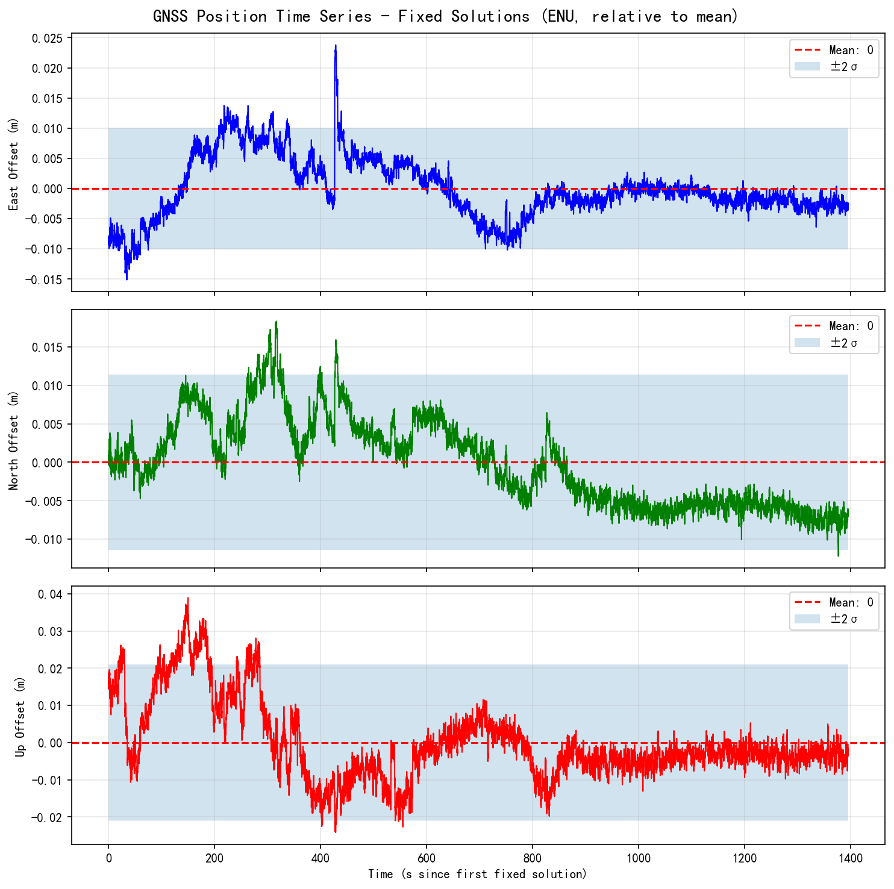
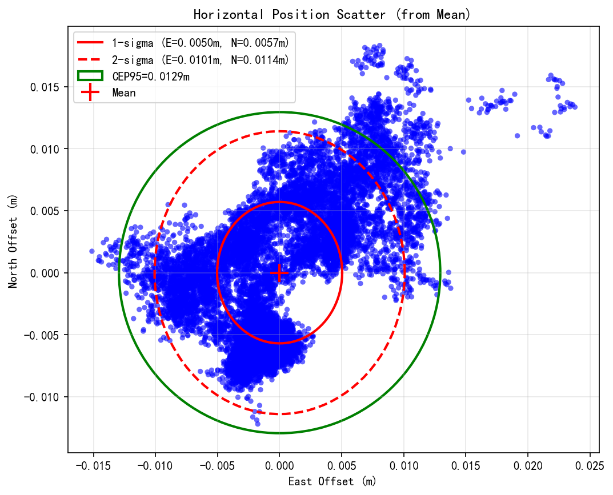
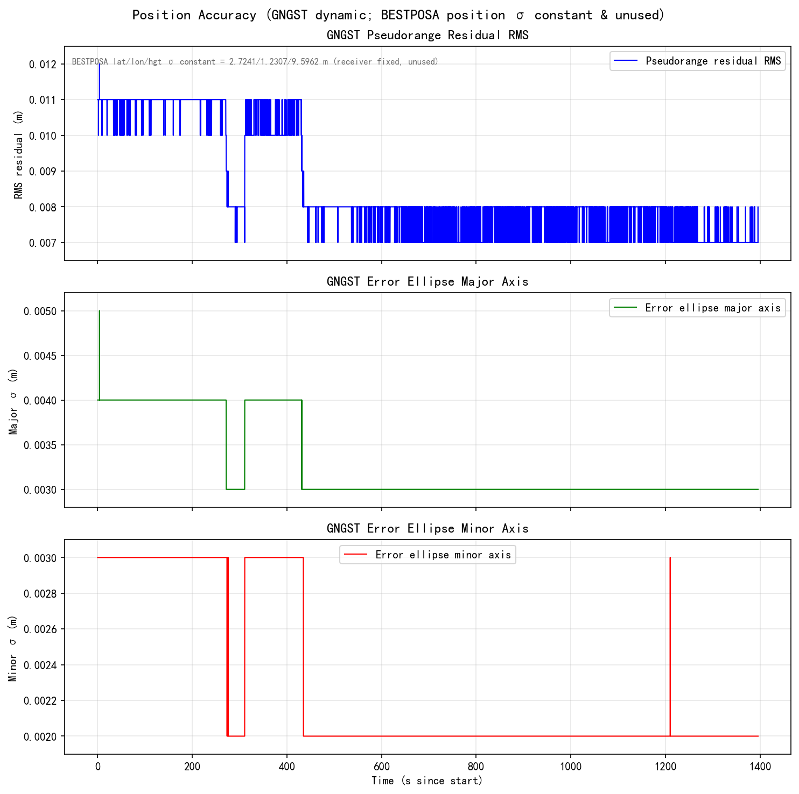
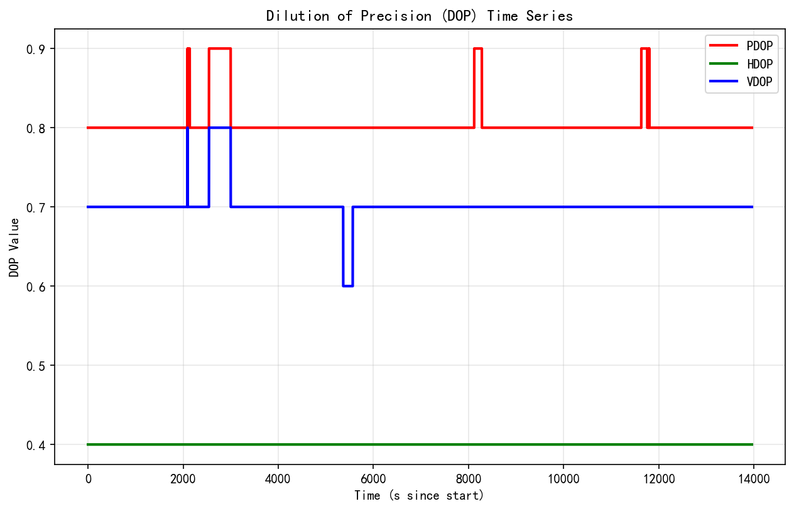
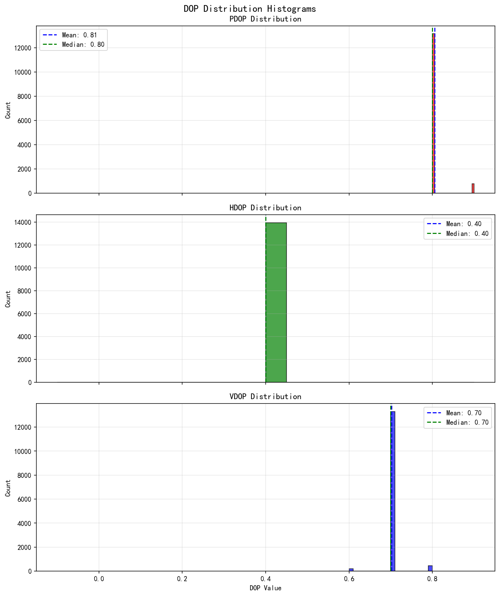
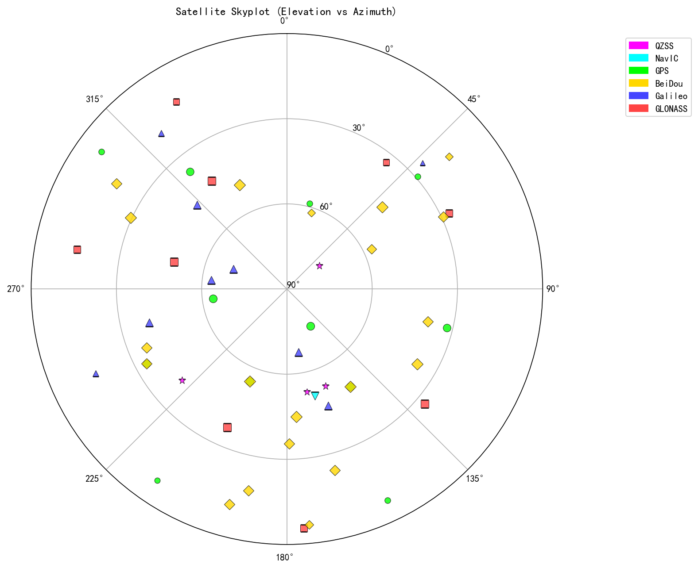
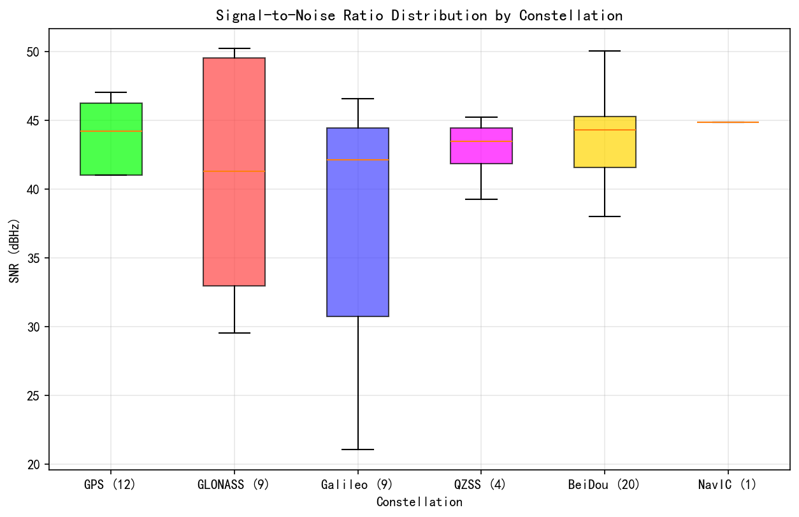
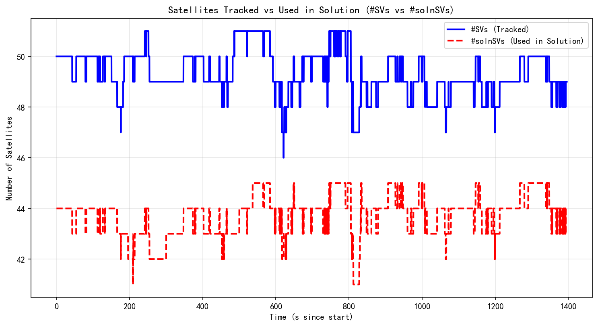
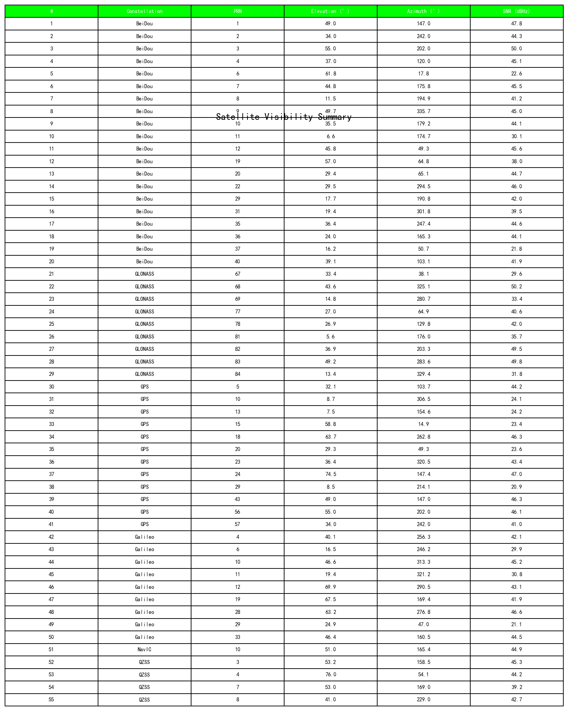

# GPS RTK静态定位分析报告

## 文件信息
- **数据文件:** 20260917095745_M720_COM11.log
- **生成时间:** 2026-09-18 15:25:55
- **持续时间:** 1395.80 秒

## 1. 数据概览

| 消息类型 | 数量 | 设置周期 | 实际周期 | 实际频率 | 均匀性 | 符合性 |
|---------|------|---------|---------|---------|--------|--------|
| BESTPOSA | 1,396 | 1.00s/1Hz | 1.000s | 1.00Hz | 均匀(CV=0.00) | 🟢符合 |
| BESTPA | 13,959 | 0.10s/10Hz | 0.100s | 10.00Hz | 均匀(CV=0.00) | 🟢符合 |
| $GNGGA | 13,959 | N/A | 0.100s | 10.00Hz | 均匀(CV=0.00) | 🟢符合 |
| BESTVA | 13,959 | 0.10s/10Hz | 0.100s | 10.00Hz | 均匀(CV=0.00) | 🟢符合 |
| RTKPA | 13,959 | 0.10s/10Hz | 0.100s | 10.00Hz | 均匀(CV=0.00) | 🟢符合 |
| RTKVA | 13,959 | 0.10s/10Hz | 0.100s | 10.00Hz | 均匀(CV=0.00) | 🟢符合 |
| ENVSTATUSA | 13,959 | 0.10s/10Hz | 0.100s | 10.00Hz | 均匀(CV=0.00) | 🟢符合 |
| $GPGSV | 39,348 | N/A | N/A | N/A | - | 报文无时间戳，周期不可实测 |
| $GLGSV | 27,918 | N/A | N/A | N/A | - | 报文无时间戳，周期不可实测 |
| $GAGSV | 39,314 | N/A | N/A | N/A | - | 报文无时间戳，周期不可实测 |
| $GBGSV | 69,795 | N/A | N/A | N/A | - | 报文无时间戳，周期不可实测 |
| $GQGSV | 13,959 | N/A | N/A | N/A | - | 报文无时间戳，周期不可实测 |
| $GIGSV | 13,959 | N/A | N/A | N/A | - | 报文无时间戳，周期不可实测 |
| SATVIS2A | 9,772 | 0.10s/10Hz | 1.000s | 1.00Hz | 均匀(CV=0.00) | 🔴偏差-90% |
| $GNGSA | 83,754 | N/A | N/A | N/A | - | 报文无时间戳，周期不可实测 |
| $GNGST | 13,959 | N/A | 0.100s | 10.00Hz | 均匀(CV=0.00) | 🟢符合 |
| BESTDOPSA | 13,959 | 0.10s/10Hz | 0.100s | 10.00Hz | 均匀(CV=0.00) | 🟢符合 |
> 说明：仅当报文自带时间字段时，实际周期/频率/均匀性为真实测量（# 类头含 TOW；NMEA 中 GGA/GST 含 UTC 时间）。GSA/GSV 无时间字段且 GSV 每历元连发多条、同历元各条同时发出，单句周期无意义，标记 N/A（数据为准，绝不臆造）。消息是否按周期发送由输出触发方式决定（ONTIME=周期；ONNEW/ONCHANGED=变化才发）。

- **数据完整性:** 100.0% (共 410,887 条消息)
- **位置信息:** 31.163282°N, 121.453147°E, 6.27 m (WGS84)
- **天线高度:** 11.030 m (测站上方)
- **报文完整性(校验位):** 有效 410,887/410,887 条 (通过率 100.0%；无效 0 条) — NMEA XOR: 315,965/315,965 (100.0%)；#类 CRC-32(表4-6): 94,922/94,922 (100.0%)

## 2. GNSS定位分析 (BESTGNSSPOSA)

### 2.1 位置时间序列

### 2.2 东西-南北散点图

| 统计项 | 东西方向 (m) | 南北方向 (m) | 高程方向 (m) |
|--------|-------------|-------------|-------------|
| 均值（以均值位置为基准的相对偏移，均值定义上恒为 0） | 0.0000 | 0.0000 | 0.0000 |
| 标准差 | 0.0050 | 0.0057 | 0.0105 |
| RMS | 0.0050 | 0.0057 | 0.0105 |
| CPE95 | 0.0129 | - | - |
| 2DRMS | 0.0152 | - | - |

### 2.3 位置精度时间序列

### 2.4 定位类型分布

| 类型 | 含义 | 次数 | 占比 |
|---|---|---:|---:|
| NARROW_INT | 窄巷固定解 | 13959 | 100.00% |
| **合计** | | **13959** | **100.00%** |

## 3. DOP分析

### 3.1 DOP时间序列

### 3.2 DOP直方图

| DOP类型 | 最小值 | 最大值 | 均值 | 标准差 | 中位数 |
|--------|-------|-------|------|--------|-------|
| PDOP | 0.80 | 0.90 | 0.81 | 0.02 | 0.80 |
| HDOP | 0.40 | 0.40 | 0.40 | 0.00 | 0.40 |
| VDOP | 0.60 | 0.80 | 0.70 | 0.02 | 0.70 |

## 4. 卫星可见性分析

### 4.1 天顶图

### 4.2 信噪比分布

**箱线图说明：**
- **箱体**：包含 25% 到 75% 的数据（四分位距）
- **黄色中线**：中位数
- **须线（Whiskers）**：显示数据的范围
- **颜色**：GPS-绿色、GLONASS-红色、Galileo-蓝色、QZSS-紫色、BeiDou-黄色
- **数据来源**：所有可见卫星的 GSV 消息中的 SNR 字段

### 4.3 卫星使用数时间序列

**说明:**
- `#SVs` (蓝色实线): 接收机跟踪到的卫星总数
- `#solnSVs` (红色虚线): 参与定位解算的卫星数

### 4.4 卫星详细信息表

## 6A. 环境感知分析（ENVSTATUSA · 华测特有 · 移动站模式）

该报文为华测模组特色，用于评估观测环境对静态定位的影响。环境越差，静态精度越易恶化。

| 字段 | 最小/均值/最大 | 好坏判断 | 说明 |
|------|--------------|---------|------|
| 环境质量分值 env_score | 73.0 / 84.3 / 93.0  | 85~100优/60~84一般/0~59差 | 综合环境评分，越高越好 |
| 卫星可视比率 | 72.0 / 78.9 / 87.0 % | 越高越好 | 跟踪星/理论可视星，反映遮挡 |
| 参与解算比率 | 68.0 / 78.0 / 89.0 % | 越高越好 | 解算星/跟踪星，反映可用性 |
| 解置信度 | 80.1 / 86.5 / 93.2  | 越高越好 | 接收机对当前解的置信程度 |
| 跟踪卫星数 | 46.0 / 49.4 / 51.0 颗 | 越多越好 | 可见并跟踪的卫星总数 |
| 共视卫星数 | 34.0 / 35.9 / 38.0 颗 | 越多越好 | 基站-Rover共视星，RTK稳定性 |
| 平均信噪比 avg_snr | 39.0 / 40.2 / 41.0 dBHz | ≥38开阔/32~37半遮挡/≤31严重 | 接收机前端信号质量 |
| PDOP | 0.8 / 0.8 / 0.9  | ≤2.5好/2.5~5一般/>5差 | 卫星几何构型 |
| 电离层活跃状态 | QUIET:1934, WEAK:2015, MODERATE:5734, STRONG:4276 | QUIET平静为佳 | 电离层扰动影响定位 |

## 6. 质量评估表

| 评估指标 | 数值 | 行业标准 | 评估结果 |
|---------|------|---------|----------|
| 固定解比例 | 100.0% | >95% | ✅ 通过 |
| 位置CPE95 | 0.0129 m | <0.02 m | ✅ 通过 |
| 水平RMS | 0.0076 m | - | - |
| 垂直RMS | 0.0105 m | - | - |
| 固定解水平峰值 | 0.0274 m | - | - |
| 固定解垂直峰值 | 0.0390 m | - | - |
| 平均PDOP | 0.81 | <3.0 | ✅ 通过 |
| 平均HDOP | 0.40 | <2.0 | ✅ 通过 |
| 数据完整性 | 100.0% | >99% | ✅ 通过 |
| 数据间隙 | 0 个 | 0 个 | ✅ 通过 |
| 固定解连续性 | 中断0次 / 最长连续固定1395.8s / 均重固定0.0s | 越少中断/越短重固定越好 | ✅ 连续 |
| 静止性(纯GNSS) | 最大偏移 0.027 m | ≤0.15 m | ✅ 静止 |
| 伪距残差RMS收敛 (GNGST) | 初 0.011 → 末 0.007 m | 收敛且小为佳 | ✅ 收敛 |
| 载噪比 C/N0 均值 | 39.6 dBHz | ≥38开阔/32-37半遮挡/≤31严重 | ✅ 开阔 |

## 7. 结论

本次GPS RTK静态定位测量数据质量总体良好。

### 优点
- 100.0%固定解比例，完全满足RTK定位要求
- PDOP和HDOP值远低于行业阈值，卫星几何构型优秀
- 数据完整性达100.0%，无数据间隙
- 接收机位置稳定，观测环境良好

### 注意事项
- CPE95为1.3厘米，达到行业标准（<2cm）
- 垂直RMS略高于水平RMS，这是静态测量的典型特征

### 建议
- 数据质量优秀，无需特别处理
- 可以增加观测时间，进一步降低随机误差
